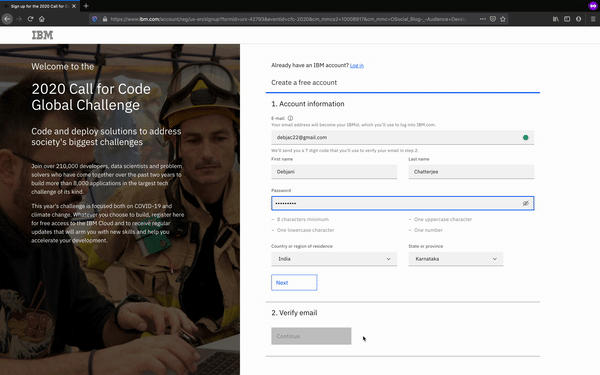
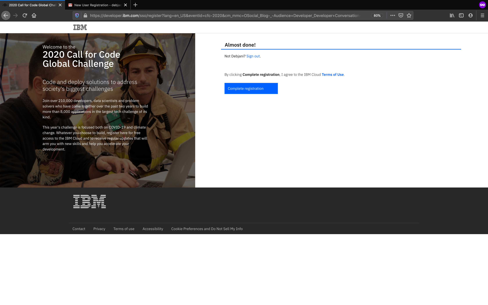

# Call for Code 2020 India Virtual Hack - Guidance Kit

## 1. Create an IBM Cloud Account

 a. Click to create [IBM cloud account](bit.ly/prayudh), if you have not done so already. Follow the steps here.

 b. Put your email id and other necessary info

 

 c. Go to your mailbox and confirm the account activation.

 

 d. You will arrive at this screen, click on 'complete registration' to finish up.

 

  **Note:** In case you already have a IBMCloud account, click on https://cloud.ibm.com/login

    a. Provide IBM ID (Email ID) which was used to cloud account registration.

    b. Put password. Use reset password in case you have forgotten the password and check for password reset instructions sent over email.

  **Common Issues**

    - You might encounter error message while creating cloud account “Registration Failure”

    Solution – Please use different Internet service provider. For example, if you encountered the error while using College WIFI, please use your personal mobile data for registration.

    - If error persists – please delete browser cache and initiate registration through “Incognito Mode” on Browser

## Explore and preferrably complete the following badges

Go to [https://cognitiveclass.ai](https://cognitiveclass.ai)

- Badge earning Duration – 3-6 Hours

  Badge details placeholder

## Get to know the community and interact with us on Slack

  Join the cfc-virtual channel
-[http://ibm.biz/dev-community](http://ibm.biz/dev-community)

  If you do not have a team of your own, you can ask in the regional community channels like #bangalore-community

## Important Resources for the hackathon

- About [CFC India Virtual Hack](https://cfc-india.eu-gb.mybluemix.net/)

- IBM Developer Website - [https://developer.ibm.com/](https://developer.ibm.com/)

- IBM Code Patterns - [https://developer.ibm.com/patterns/](https://developer.ibm.com/patterns/)

- IBM Learning website - [https://cognitiveclass.ai/](https://cognitiveclass.ai/)

- Call for Code Global Challenge - [https://callforcode.org/](https://callforcode.org/)

- United Nations on Climate Change - [https://www.un.org/en/climatechange](https://www.un.org/en/climatechange/)

- IBM Developer on YouTube - [http://ibm.biz/isadeveloper](http://ibm.biz/isadeveloper)

- IBM Skills Gateway - [https://www.ibm.com/training](https://www.ibm.com/training)
