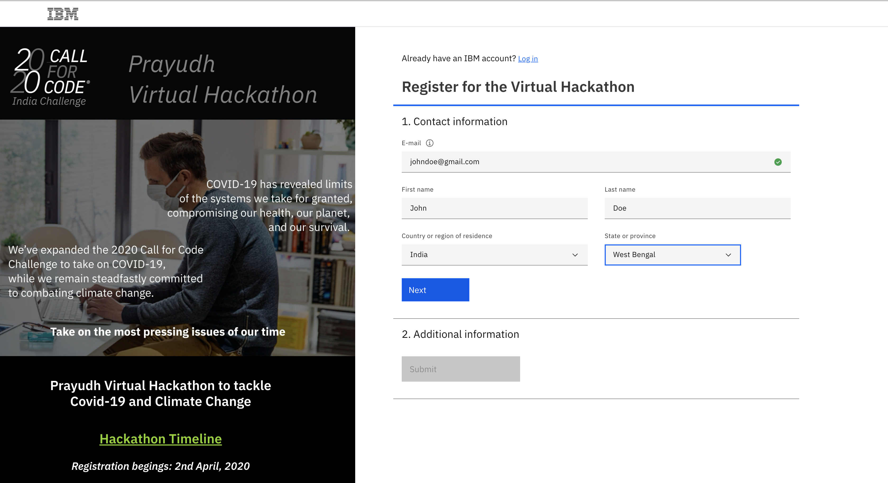
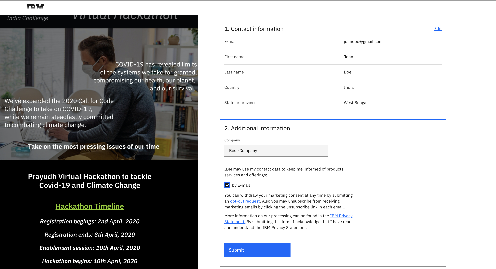
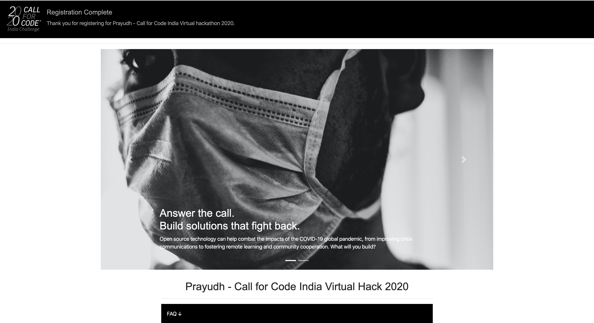
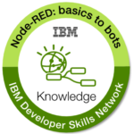
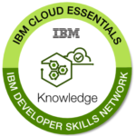
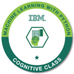

# Call for Code 2020 India Virtual Hack - Guidance Kit

## 1. Create an IBM Cloud Account

 a. Click to create [IBM cloud account](bit.ly/prayudh), if you have not done so already. Follow the steps here.

b. Put your email id and other necessary info and click 'Next'.

 

 c. Fill in your Company or College details, opt in for Email and click 'Submit'.

 

 d. You will arrive at this screen, your registration is done. Go through the details for participation.

 

  **Note:** In case you already have a IBMCloud account, click on https://cloud.ibm.com/login

    a. Provide IBM ID (Email ID) which was used to cloud account registration.

    b. Put password. Use reset password in case you have forgotten the password and check for password reset instructions sent over email.

  **Common Issues**

    - You might encounter error message while creating cloud account “Registration Failure”

    Solution – Please use different Internet service provider. For example, if you encountered the error while using College WIFI, please use your personal mobile data for registration.

    - If error persists – please delete browser cache and initiate registration through “Incognito Mode” on Browser

## Explore and preferrably complete one or more of the following badges

Go to [https://cognitiveclass.ai](https://cognitiveclass.ai)

- Badge earning Duration – 3-6 Hours

 | Badge    |      Name     |  Description|
 |----------|:-------------:|------:|
 ||[Node-RED: basics to bots](https://cognitiveclass.ai/badges/node-red-basics-to-bots)| This badge earner understands how to create simple to complex applications in the Node-RED flow editor. These applications include a Node-RED boilerplate that uses JavaScript and built in IBM Cloud; a REST API; Watson cognitive applications that can translate text, analyze tone, replay audio and video, and send tweets to Twitter; and a Facebook Messenger bot that uses the Watson Assistant service.|
 | | [IBM Cloud Essentials](https://cognitiveclass.ai/badges/ibm-cloud-essentials) | Get an understanding of the relevance of IBM Cloud platform in the cloud computing paradigm. Understanding of the high level architecture of IBM Cloud. Understanding of boilerplates, services and runtimes supported on IBM Cloud. Ability to develop and deploy simple applications using IBM Cloud services on the IBM Cloud platform. |
 || [Machine Learning with Python](https://cognitiveclass.ai/badges/machine-learning-python) | The badge earner has demonstrated an understanding of Supervised vs. Unsupervised Learning, how Statistical Modelling relates to Machine Learning, and how to build and evaluate machine learning models. |

## Get to know the community and interact with us on Slack

  Join the cfc-virtual channel
-[http://ibm.biz/dev-community](http://ibm.biz/dev-community)

  If you do not have a team of your own, you can ask in the regional community channels like #bangalore-community

## Important Resources for the hackathon

- About [CFC India Virtual Hack](https://cfc-india.eu-gb.mybluemix.net/)

- IBM Developer Website - [https://developer.ibm.com/](https://developer.ibm.com/)

- IBM Code Patterns - [https://developer.ibm.com/patterns/](https://developer.ibm.com/patterns/)

- IBM Learning website - [https://cognitiveclass.ai/](https://cognitiveclass.ai/)

- Call for Code Global Challenge - [https://callforcode.org/](https://callforcode.org/)

- United Nations on Climate Change - [https://www.un.org/en/climatechange](https://www.un.org/en/climatechange/)

- IBM Developer on YouTube - [http://ibm.biz/isadeveloper](http://ibm.biz/isadeveloper)

- IBM Skills Gateway - [https://www.ibm.com/training](https://www.ibm.com/training)
